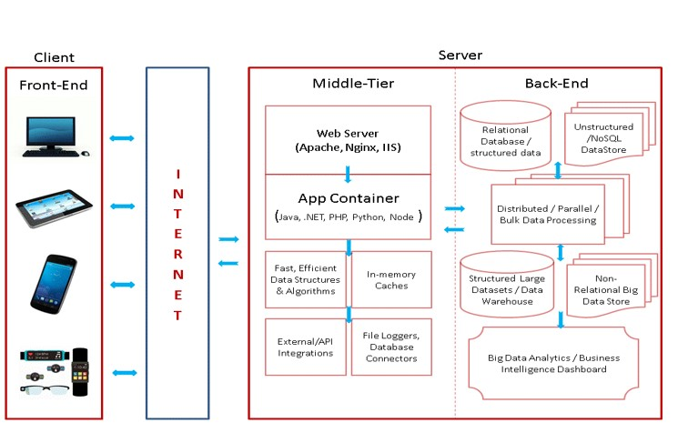

# Как работает веб. Клиент-серверная архитектура

Для успешного изучения веб-разработки важно понять, как устроена работа веба и как взаимодействуют его основные элементы. Одной из ключевых архитектур веб-приложений является клиент-серверная архитектура. Давайте разберем основные понятия и простой пример работы, чтобы эта концепция стала более понятной.

## Основные Понятия

- **Клиент** — устройство или программа, отправляющая запрос серверу и получающая ответ. **Примеры**: веб-браузер, мобильное приложение [^1].
- **Сервер** — устройство или программа, обрабатывающая запросы клиентов и отправляющая ответы. **Примеры**: веб-сервер, сервер базы данных.
- **Запрос** — сообщение, отправляемое клиентом серверу для получения данных или выполнения действия. **Примеры**: запрос веб-страницы, отправка формы.
- **Ответ** — сообщение, отправляемое сервером клиенту в ответ на запрос. **Примеры**: HTML-страница, JSON-данные, изображение.
- **Протокол** — набор правил, определяющих формат и порядок передачи данных. **Пример**: **HTTP** (HyperText Transfer Protocol) — основной протокол передачи данных в вебе.

## Клиент-Серверная Архитектура

**Клиент-серверная архитектура** — это модель взаимодействия, где клиент (например, браузер) запрашивает данные, а сервер их предоставляет. Общение происходит через сеть, обычно по протоколу _HTTP_.

Пример в жизни:

- **Клиент:** _"Привет, сервер, мне нужна информация!"_
- **Сервер:** _"Вот, держи!"_

### Клиентские и Серверные Скрипты

1. **Клиентские скрипты (Client-side scripts)** — выполняются в браузере пользователя. Используются для создания интерактивных элементов и взаимодействия с пользователем. **Пример:** динамическое изменение содержимого страницы без перезагрузки.
2. **Серверные скрипты (Server-side scripts)** — выполняются на сервере. Они обрабатывают запросы, управляют данными и отправляют результаты клиенту. **Пример:** аутентификация пользователя или обработка данных формы.

## HTTP и Коды Состояния

**HTTP** — это протокол передачи гипертекста, определяющий правила общения между клиентом и сервером.

**Примеры кодов состояния:**

- **200 OK** — запрос обработан успешно.
- **404 Not Found** — ресурс не найден.
- **500 Internal Server Error** — ошибка на сервере.

> [!TIP]
> Использование кодов состояния помогает разработчикам диагностировать проблемы.

## Пример работы Клиент-Сервера

1. Пользователь вводит адрес сайта в браузере.
2. Браузер (клиент) отправляет запрос серверу с просьбой предоставить главную страницу сайта.
3. Сервер обрабатывает запрос и отправляет ответ браузеру: HTML-страницу, стили (CSS), скрипты (JavaScript).
4. Браузер отображает страницу для пользователя.

## Веб-Сервер

Когда запрос поступает на сервер, его обрабатывает специальная программа — **веб-сервер**.

### Задачи веб-Сервера

1. Принять запрос клиента.
2. Обработать запрос:
   - Найти нужный ресурс (например, HTML-файл).
   - Выполнить взаимодействие с другими программами (например, с приложением PHP).
3. Отправить ответ клиенту.

> [!NOTE]
> Ресурсы могут быть HTML-страницами, изображениями или другими данными.

## Объяснение на примере ресторана

Представьте ресторан:

- **Вы — клиент:** вы заказываете еду.
- **Официант — сервер:** принимает заказ, передает его повару и возвращает готовое блюдо.

## Сервер как Клиент

Сервер может быть клиентом в другом взаимодействии.

Когда сервер запрашивает данные из другого сервера, он выступает в роли клиента.

Например, ваш сервер может запрашивать информацию о погоде с другого сервера, предоставляющего погодные данные. В данном случае ваш сервер является клиентом, а сервер с погодными данными — сервером.

Главное запомнить, что клиент запрашивает данные, а сервер предоставляет их. При этом одно устройство может быть клиентом и сервером одновременно, в зависимости от контекста и взаимодействия.

[^1]: _Клиент и сервер_. ibm.com [online resource]. Available at: https://www.ibm.com/docs/ru/aix/7.1?topic=systems-client-server
